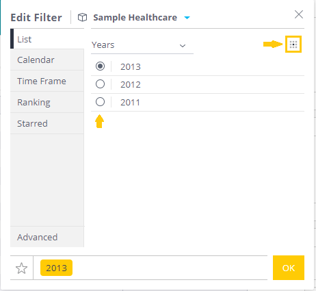
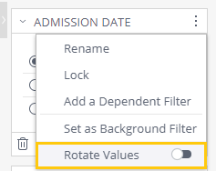

# Sisense Add-on: Rotating Values Filter

> **DISCLAIMER - PLEASE NOTE**  
> The add-on contained within this repository was built for educational purposes only, to be used as an example for a tutorial on https://sisense.dev.  
> It is not intended to be used in a production deployment as is.  
> No support or maintenance will be provided for this add-on.

This Sisense add-on allows a dashboard filter to be set into "rotating" mode, which will update the filter's value every few seconds to show different slices of data on the dashboard automatically.

This can be useful for displaying a dashboard on a TV or streaming/casting it.

## Limitations

1. This add-on is intended for use on Linux versions of Sisense, and was only tested on L2021.5.0.
1. Rotation can only be applied to simple "Single Select" type filters. Any other type of filter, including cascading filters, is not supported.
1. Only one filter can be rotated per dashboard at a time. Turning rotation on for another filter, will toggle it off for any previous filter that was rotating.

## Setup

1. Install the add-on in the `plugins` directory on your Sisense server
1. Optionally, you can modify the add-on's default configuration in the `config.6.js` file:  
   ```js
    module.exports = {
        rotationInterval: 15000, // Modify this if you need to have a different interval. (in milliseconds)
        maxValuesToLoad: 100 // Modify this if you need to load more/fewer values to rotate on.
    }
   ```

## Usage

1. Open a dashboard where you'd like to set up a rotating filter
1. Make sure the desired filter is a `List` type filter, and is set in "single select" mode (showing radio buttons and not check boxes):  
   
1. Click on the desired filter's context menu icon, and toggle the "rotate values" toggle:  
   
1. Wait a few seconds for the dashboard to reload - it should start rotating every 15 seconds (if default interval is kept)
